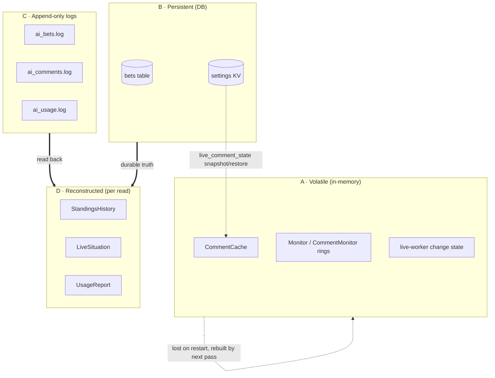
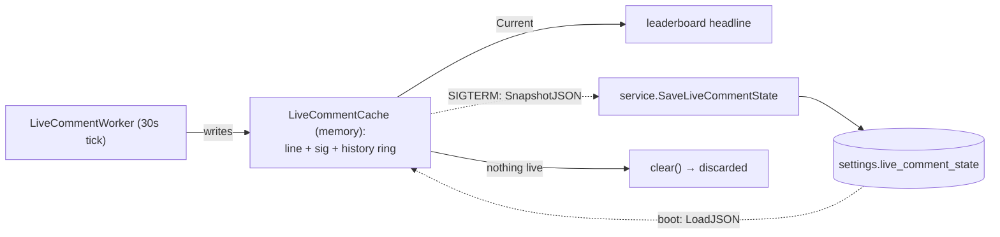
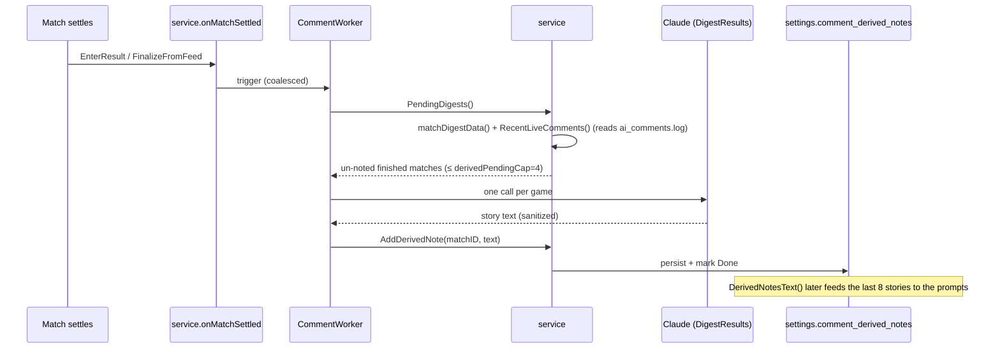

# BETanIA's memory tiers

How the AI player (**BETanIA 🤖**) stores and remembers state — and, just as
important, what it *deliberately forgets*. This is the single reference for "what
does BETanIA know, where does it live, and does it survive a restart or a
deploy?"

BETanIA is optional (`BETHOVEN_AI_ENABLED`); with it off, none of the writers
below run and every tier is empty/absent. The `internal/ai` package **never
imports `service`** — everything below flows through function seams
(`Deps` / `CommentDeps` / `LiveCommentDeps` / `CommentConfig`), so "BETanIA
remembers X" always means "a worker read X through a seam."

---

## The one principle

> **Non-reproducible truth is persisted. Reconstructable presentation is thrown
> away and rebuilt.**

Her predictions, the admin's configuration, and the audit logs are the
non-reproducible truth — they live in the DB and on disk. Everything a viewer
*sees* (roasts, the live headline, the usage rollup) is either rebuilt from that
truth on the next worker pass or recomputed on every read. The one exception is
a usability hack: the live-commentary line is volatile but snapshotted to the DB
on shutdown so a deploy mid-game doesn't blank it.

State falls into **four storage classes**:

---

## Master taxonomy

| Tier | Class | Where it lives | Survives restart? | Survives deploy? | Purpose |
|---|---|---|---|---|---|
| `CommentCache` | A · Volatile | `internal/ai/comment_cache.go` | ❌ rebuilt next pass | ❌ | Per-player leaderboard roasts |
| `Monitor` (betting) | A · Volatile | `internal/ai/monitor.go` | ❌ | ❌ | Admin betting activity feed + status |
| `CommentMonitor` | A · Volatile | `internal/ai/comment_monitor.go` | ❌ | ❌ | Admin comment activity feed + status |
| live-worker change state | A · Volatile | `internal/ai/live_commenter.go` | ❌ | ❌ | Change-detection + regen rate-limit |
| `LiveCommentCache` | A↔B · Hybrid | memory + `settings.live_comment_state` | ⚠️ via snapshot | ✅ via snapshot | Live headline + anti-repeat history |
| `bets` table | B · Persistent | `internal/db/schema.sql` | ✅ | ✅ | Long-term prediction memory |
| `comment_derived_notes` | B · Persistent | `settings` KV | ✅ | ✅ | Per-game "story of the game" diary |
| `comment_context` | B · Persistent | `settings` KV | ✅ | ✅ | Rivalries + house notes |
| `comment_mood` | B · Persistent | `settings` KV | ✅ | ✅ | Self-evolving mood |
| `comment_tone` / `…_u_<id>` | B · Persistent | `settings` KV | ✅ | ✅ | Global + per-player tone / mute |
| `comment_prompt_override` | B · Persistent | `settings` KV | ✅ | ✅ | Custom instruction body |
| `lb_comments_off_u_<id>` | B · Persistent | `settings` KV | ✅ | ✅ | Per-viewer hide preference |
| `ai_bets.log` | C · Log | `BETHOVEN_AI_LOG_PATH` | ✅ | ✅ | Pick audit trail |
| `ai_comments.log` | C · Log | `BETHOVEN_AI_COMMENT_LOG_PATH` | ✅ | ✅ | Comment audit + live-story read-back |
| `ai_usage.log` | C · Log | `BETHOVEN_AI_USAGE_LOG_PATH` | ✅ | ✅ | Token/cost ledger |
| `StandingsHistory` | D · Derived | `service_history.go` | n/a (per read) | n/a | Per-matchday narrative facts |
| `LiveSituation` | D · Derived | `service_live_comment.go` | n/a (per read) | n/a | Director's live snapshot |
| `RecentLiveComments` | D · Derived | `internal/ai/digest.go` | n/a (reads log) | n/a | Recovers a match's live story |
| `PendingDigests` | D · Derived | `service_derived_notes.go` | n/a (DB-driven) | n/a | Finished-but-un-noted matches |
| `UsageReport` | D · Derived | `internal/ai/usage.go` | n/a (reads log) | n/a | Read-time cost rollup |

---

## Class A — Volatile / in-memory

Lives only for the process lifetime in `internal/ai`. A restart starts each one
empty; the next worker pass refills it. This is intentional — these tiers hold
*presentation*, which is cheap to rebuild from the durable truth.

### `CommentCache` — per-player roasts
`internal/ai/comment_cache.go`. A `map[int64]Comment` (user id → roast),
concurrency-safe. The `CommentWorker` writes it:

- **`Replace([]Comment)`** swaps in a whole fresh set each full pass, so a player
  who no longer has a story stops showing a stale line.
- **`Upsert(Comment)`** replaces one player in place — the admin "regenerate this
  one" action, leaving every other line untouched.

Read by the service's `CommentSource` port (`All(now)`) for the leaderboard.

**Deliberate no-clock-expiry (not a bug).** `All()` skips entries past
`ExpiresAt + commentGrace` (`commentGrace = time.Hour`), *but* the writers
intentionally set `ExpiresAt = time.Time{}` (`commenter.go:154` and `:208`,
commented "never expires on a clock — replaced by the next pass"). So a comment
lives until the next pass overwrites it; the grace check is a safety net that
only bites if the worker dies — then ancient roasts eventually vanish instead of
lingering forever. The machinery is dormant by design, not dead code.

### `Monitor` and `CommentMonitor` — observability rings
`internal/ai/monitor.go` (betting) and `comment_monitor.go` (comments). Each
holds model + interval + `lastRun`, **cumulative** counters
(placed/skipped/locked/errored, or written/errored), and a ring of the last
**`monitorRing = 50`** actions (oldest-first, trimmed on overflow). Read by the
`AIMonitor` / `AICommentMonitor` ports for the admin BETanIA panel.

**Wiped on restart** — counters zero, ring empties. This is *why* the admin
"Picks on record" reads from the DB (`AIBets`) instead of this ring: the ring
only fills as the worker acts *this* process lifetime (the old "Recent picks:
nothing yet" after a restart). The rings answer "what has she done since boot?";
the DB answers "what has she ever done?".

### Live-worker change-detection state
Fields on `LiveCommentWorker` (`internal/ai/live_commenter.go`):

- **`lastGen`** — wall-clock of the last generated line, enforcing the floor
  (`liveFloor = 120s`) and the heartbeat. Reset to zero when nothing is live, so
  the next game fires immediately.
- **`lastRegen`** (map of player name → time) — rate-limits per-player roast
  regenerations the director triggers, one player no more often than
  `commentRegenFloor = 15m`. Persists across games within a session.

Pure housekeeping; never persisted (a stale floor/heartbeat after a restart would
be meaningless).

---

## The hybrid: `LiveCommentCache`

`internal/ai/live_commenter.go`. Volatile like Class A, but with a DB snapshot
that makes it survive a deploy. It holds the single top-of-board live line, its
`expiresAt`, the situation `sig` (change-detection hash of scores + movers + key
events + phase, **not** the clock), and a `history` ring of the last
**`liveHistoryMax = 5`** lines fed back to the model for anti-repeat.

- **Throwaway in normal operation** — `clear()` zeroes the cache the moment
  nothing is live, so a game's lines are discarded as it ends.
- **Snapshot on shutdown** — `main` catches SIGTERM, calls `SnapshotJSON()`, and
  persists it via `service.SaveLiveCommentState` into `settings.live_comment_state`.
- **Restore on boot** — `main` calls `LoadLiveCommentState` → `LoadJSON`, so the
  current line + anti-repeat history resume across a `systemctl restart`.
- **Self-correcting** — if the snapshot is stale (the game ended while down), the
  next pass sees nothing live and clears it.

This is the only volatile tier that survives a deploy, and only because blanking
the live headline mid-match during a routine binary swap looks broken.

---

## Class B — Persistent / DB-backed

The durable truth. Survives restarts and deploys (it's in `bethoven.db`).

### The `bets` table — long-term prediction memory
`internal/db/schema.sql` — the same table every human uses, `UNIQUE(user_id,
match_id)`. BETanIA's identity is the reserved fingerprint
`bethoven:ai-betania` (the non-`SHA256:` prefix can never collide with a real SSH
key, so it's a pure system account with no login). Two write paths:

- **Seed** (`bethoven ai-seed`) writes via `store.UpsertBet` **directly** — the
  one sanctioned kickoff-lock bypass, valid because those games are already
  locked.
- **Live worker** (`ai.Bettor`) writes via `service.PlaceBet`, so the kickoff
  lock fully applies.

Read by `service.AIBets` (admin only) for "Picks on record". This is BETanIA's
real memory of what she predicted — everything else about her bets
(`Monitor` ring, `ai_bets.log`) is derived from or redundant with it.

### `settings` KV tiers
All in the single `settings` table, read/written through service helpers. Absent
⇒ the documented default, so existing pools are unaffected until an admin opts in.

| Key | Const · file | Shape | Default | Written by | Read by |
|---|---|---|---|---|---|
| `comment_derived_notes` | `settingDerivedNotes` · `service_derived_notes.go` | JSON `storedDerived` | empty, `Seeded=false` | digest worker | per-player + live prompts |
| `comment_context` | `settingCommentContext` · `service_comment_config.go` | JSON `storedContext` | empty | admin | `CommentConfig` |
| `comment_mood` | `settingCommentMood` · `service_comment.go` | string (`MoodValues`) | `neutral` | live director | `CommentConfig.Mood` |
| `comment_tone` | `settingCommentTone` · `service_comment.go` | `playful`\|`savage` | `playful` | admin | `CommentConfig` |
| `comment_tone_u_<id>` | `settingUserTonePrefix` · `service_comment_config.go` | `default`\|`playful`\|`savage`\|`mute` | inherit | admin | worker + read-time |
| `comment_prompt_override` | `settingCommentPromptOverride` · `service_comment_config.go` | text | "" (built-in) | admin | both comment prompts |
| `live_comment_state` | `settingLiveCommentState` · `service_live_comment.go` | opaque JSON snapshot | "" | `main` on SIGTERM | `main` on boot |
| `lb_comments_off_u_<id>` | `settingHideCommentsPrefix` · `service_comment.go` | `1`\|`0` | `0` | the viewer | leaderboard read |

**`comment_derived_notes` — the per-game diary.** The richest tier.
`storedDerived{Seeded bool, Done []int64, Notes []derivedNote}` holds one
condensed "story of the game" per finished match. Lifecycle:

- Seams: `PendingDigests` (what still needs a note), `AddDerivedNote` (store +
  mark done), `DerivedNotesText` (last `derivedNoteFeedCap = 8` stories, joined,
  for prompts).
- Caps: `derivedPendingCap = 4` (max digests per pass, a burst backstop),
  `derivedNoteFeedCap = 8` (max stories fed to a prompt),
  `derivedLiveStoryCap = 30` (max live lines pulled into one game's story).
- **No backfill.** The first pass sets `Seeded` and adopts the already-finished
  slate as `Done` *without* narrating it, so enabling or clearing mid-tournament
  never re-narrates the past — each game is noted exactly once.
- Admin curation (`screenAIContext`): `DeleteDerivedNote`, `CompactDerivedNotes`
  (keep only the latest), `ClearDerivedNotes` (wipe + re-seed).
- Feeds both the per-player roasts and — since the latest change — the **live
  top-of-board commentary**, so BETanIA can thread a narrative across
  back-to-back games ("nailed it again", "whiffed again").

**`comment_mood`** is written by the live director once per pass (it picks a mood
from `MoodValues` via the `submit_live_comment` tool), validated by
`SetCommentMood`, and read into `CommentConfig.Mood` to colour *every* comment
via `MoodLine`. Persisted so her personality doesn't reset on restart.

**`comment_tone` / per-player overrides.** Global default plus
`comment_tone_u_<id>`. The special value **`mute`** means that player gets **no
comment anywhere**, enforced at *read* time in `LeaderboardComments` /
`AllLeaderboardComments` / `AICommentActivity`, so muting takes effect
immediately without waiting for a regeneration pass.

**`live_comment_state`** is the DB half of the hybrid above — see that section.

**`lb_comments_off_u_<id>`** is a *viewer* preference (the `h` key): hide
BETanIA's comments on my own leaderboard. Distinct from `mute`, which stops her
commenting *on* a player for everyone.

> Also in `settings` but not AI-specific: `public_bets` and `scoring_mode`. They
> aren't BETanIA's memory, but they change how `AIBets` scores and reveals her
> picks, so they're worth knowing about.

---

## Class C — Append-only logs

JSON-lines files, durable, human-readable. In prod all three live under the
systemd `ReadWritePaths` data dir (`/opt/bethoven/data/`) — they need `sudo` to
read and **must** be inside that dir or writes fail. All untrusted model text is
run through `sanitizeText` before it's logged.

| File | Env (default) | Line shape | Written by | Read back by |
|---|---|---|---|---|
| `ai_bets.log` | `BETHOVEN_AI_LOG_PATH` (`ai_bets.log`) | `logEntry{at, source, match, score, confidence?, rationale?}` | `appendLog` (seed + `Bettor`) | humans (audit) |
| `ai_comments.log` | `BETHOVEN_AI_COMMENT_LOG_PATH` (`ai_comments.log`) | `commentLogEntry{at, source, player, tone?, text}` | `appendCommentLog` + `appendLiveCommentLog` | `RecentLiveComments` |
| `ai_usage.log` | `BETHOVEN_AI_USAGE_LOG_PATH` (beside `ai_bets.log`) | `usageRecord{at, category, model, calls, in/out tokens, web_searches?, latency_ms, ok}` | `UsageLog.Record` | `UsageLog.Report` |

- **`ai_comments.log` is dual-source.** `source:"comment"` lines are per-player
  roasts (with `player` + `tone`); `source:"live_comment"` lines are the
  top-of-board headline (no player). Same file, filtered by `source`.
- **It's also read back.** `RecentLiveComments` scans it for `live_comment` lines
  since a match's kickoff to recover that game's live "story" — because the live
  worker discards its in-memory lines the moment a match ends, the log is the only
  surviving copy when the digest runs.
- **`ai_usage.log` sums an agentic loop into one line** — a web-search bet that
  made several API calls is one record. Categories: `bet`, `comment`, `live`,
  `digest`. Path auto-derives beside `ai_bets.log`, so a single data-dir setting
  carries all three logs.

---

## Class D — Reconstructed / derived

Computed fresh on every read from the DB or the logs; never stored. Cheap enough
to recompute, and storing them would just risk staleness.

- **`StandingsHistory` / `rankUsers`** (`service_history.go`) — folds *finished*
  matches by UTC matchday into a positions + `Movement`/`PointsGained` series,
  using the same tiebreak comparator as the live `Leaderboard`. Feeds the comment
  worker's narrative detection (who climbed, who fell, by how much).
- **`LiveSituation`** (`service_live_comment.go`) — the director's per-pass
  snapshot: in-play matches (score/clock/odds/key events/closest picks),
  about-to-kick-off games, just-settled games (within `settledWindow = 10m`),
  movers, and full standings. Built from `LivePicks` / `Fixtures` / `Leaderboard`.
- **`RecentLiveComments`** (`internal/ai/digest.go`) — recovers a finished
  match's live story from `ai_comments.log` (see Class C).
- **`PendingDigests`** (`service_derived_notes.go`) — finished matches with no
  derived note yet, driven by the `Done` set in `comment_derived_notes`. The
  *list* is recomputed each call; the truth behind it (what's `Done`) is
  persisted.
- **`UsageReport`** via `UsageLog.Report()` → `aggregateUsage` — rolls the whole
  usage log into per-category totals + grand total with estimated USD cost
  (`modelPrices`, longest-prefix match; unknown models flagged) and average
  latency. Read-time only, so editing the price table is live.

---

## Cross-cutting invariants

- **Sanitization boundary.** Every piece of untrusted model output (rationale,
  comment, live line, digest) renders into terminals and logs — the same
  ANSI-injection boundary as display names. `sanitizeText` strips whole CSI
  sequences + C0/C1 controls (strip-don't-reject) at the source, before the cache
  and the log, so both get clean text.
- **No `service` import in `ai`.** The package stays import-cycle free; all data
  reaches the workers through function seams (`Deps`, `CommentDeps`,
  `LiveCommentDeps`, `CommentConfig`). "BETanIA remembers X" = "a worker read X
  through a seam," never a direct DB call from `ai`.
- **Read-time resolution.** Display names (rivalries, AIBets), estimated cost, and
  `mute` are all resolved when read, not when written — so a rename, a price
  edit, or a fresh mute takes effect without a regeneration pass.
- **Restart vs deploy.**
  - *Lost on either, rebuilt next pass:* `CommentCache`, both monitor rings,
    live-worker change state.
  - *Preserved on both:* the `bets` table, every `settings` tier, all three logs.
  - *Preserved by the snapshot trick:* the live-commentary line + anti-repeat
    history (`live_comment_state`).

---

## See also

- `docs/espn-api.md` — the live feed that grounds `LiveSituation`.
- `CLAUDE.md` — the BETanIA section (the worker behaviours that read/write these tiers).
