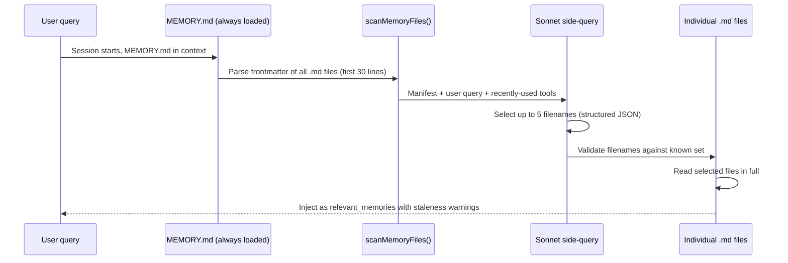
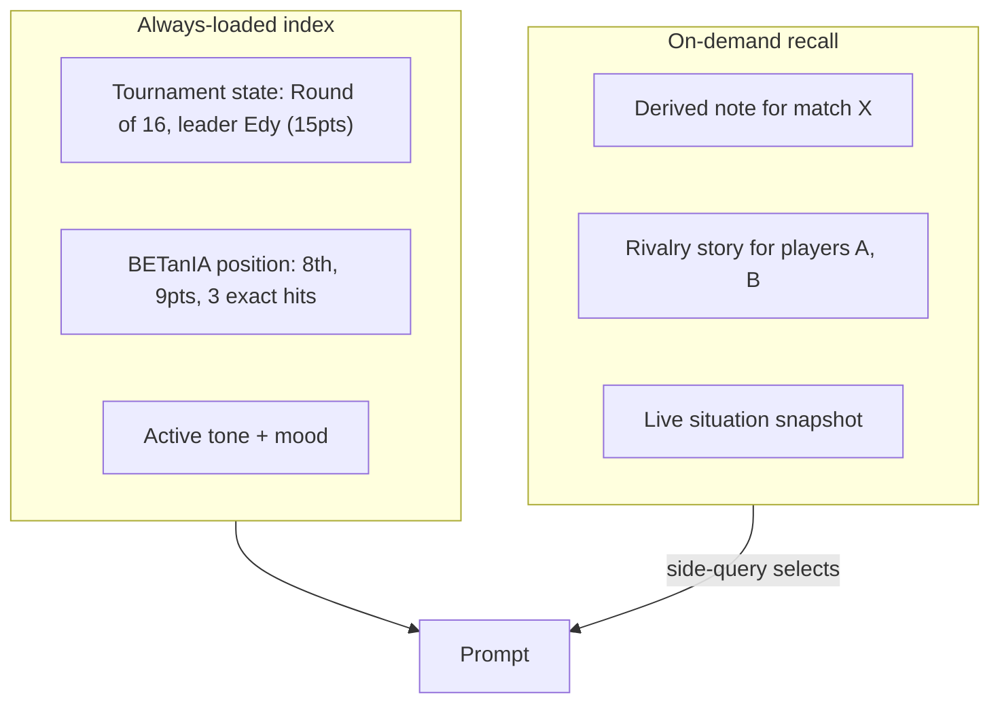
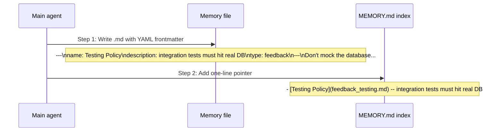
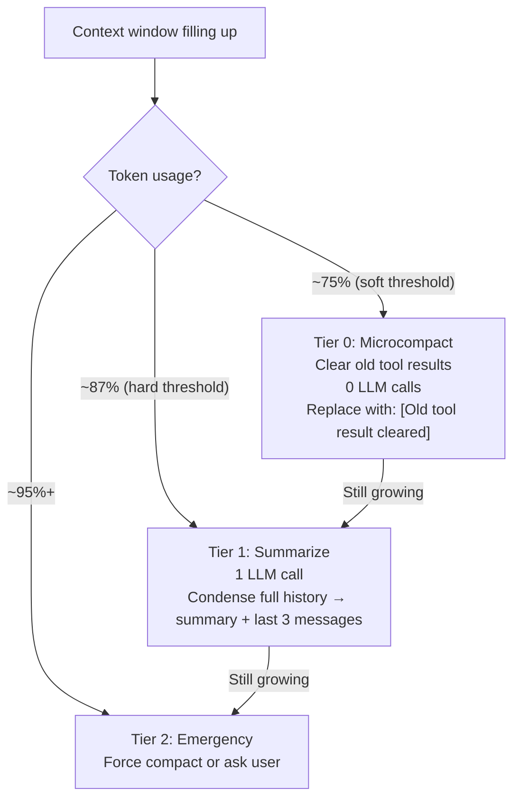
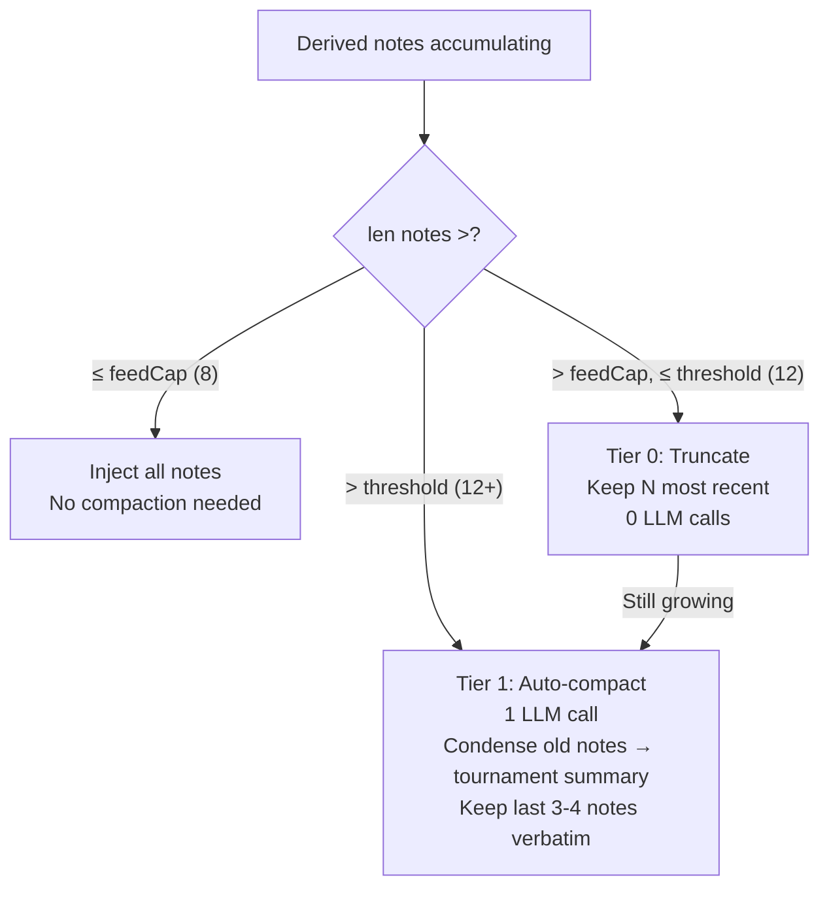
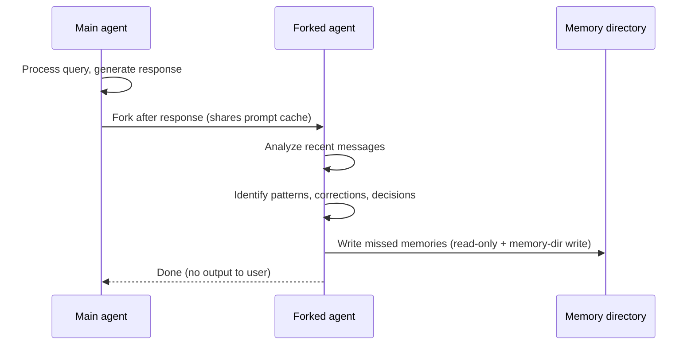
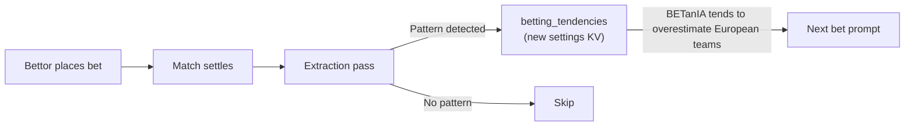
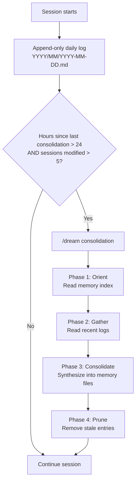
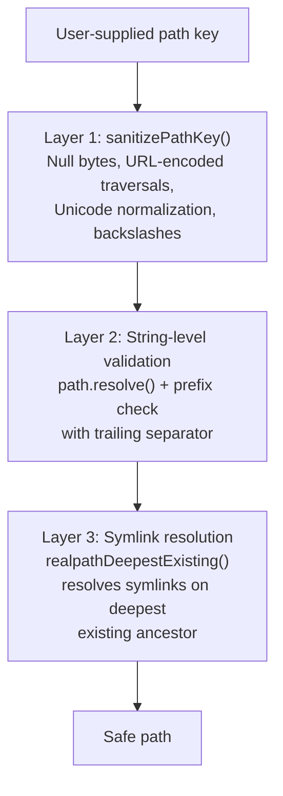

# Claude Code Memory System — Source Code Research

Concepts extracted from the decompiled source (`nadonghuang/claude-code` v2.1.76, 1,884 TS files) and the architectural analysis book ([claude-code-from-source.com](https://claude-code-from-source.com), Chapter 11). Cross-referenced with official docs at `code.claude.com/docs/en/memory`.

This document maps each concept to BETanIA's existing architecture and flags where it applies, where it's premature, and where it's a direct fit.

---

## 1. MEMORY.md — The Always-Loaded Index

### How Claude Code does it

`MEMORY.md` is a **table of contents**, not content. It sits at `~/.claude/projects/<sanitized-git-root>/memory/MEMORY.md` and is always loaded at session start — but it only contains one-line pointers to individual memory files.

**Hard caps:** 200 lines, 25,000 bytes. Each entry is ~150 chars max.

**Format:**

```
- [Testing Policy](feedback_testing.md) -- integration tests must hit real DB, not mocks
- [Project Architecture](project_arch.md) -- hexagonal, service/infra/domain split
```

The byte cap catches an observed failure mode: users packing long lines that stay under 200 lines but consume enormous token budgets (97th percentile: 197 lines = 197KB).

### Recall pipeline

The full recall system is in `src/memdir/findRelevantMemories.ts`:



**Key properties:**

1. **Manifest is cheap** — only frontmatter (first 30 lines), not full files
2. **Sonnet side-query** — cheaper model does selection, not the main model
3. **Hallucination guard** — selected filenames are validated against the known set
4. **Conservative by default** — "only include memories that will **clearly** be useful; if uncertain, don't include"

### BETanIA mapping

**Today:** BETanIA injects everything into every prompt — standings, derived notes, rivalries, tone, house notes, mood. No selectivity.

**Application (future):** When total context exceeds ~6-8K tokens, split into:



**Verdict:** Valid concept but premature today. Total BETanIA context is ~3-4K tokens. Implement when context grows past 6K (longer tournaments, more derived notes). `CompactDerivedNotes` + `feedCap` solves the same problem more simply for now.

---

## 2. Four-Type Memory Taxonomy

### How Claude Code does it

From `src/memdir/memoryTypes.ts`, memories are constrained to exactly four types. Each type captures context **NOT derivable** from the current project state:

| Type | Scope | Description | Example |
|------|-------|-------------|---------|
| `user` | Always private | Info about the user's role, goals, expertise | "User is a senior Go engineer new to React" |
| `feedback` | Default private, team for project-wide conventions | Corrections AND confirmations. Must include **Why:** and **How to apply:** | "Don't mock the database in integration tests. Why: we got burned. How to apply: use real PGlite" |
| `project` | Strongly biased toward team | Ongoing work context: who, what, why, by when | "Migrating auth from JWT to session cookies by June" |
| `reference` | Usually team | Pointers to external systems | "Linear project: ENG-123, Slack channel: #deploys" |

**The exclusion principle:** Code patterns, architecture, git history, debugging solutions, and anything in `CLAUDE.md` are explicitly excluded. If knowledge is derivable from the codebase, it should NOT be saved as memory.

### Write protocol (two-step)

Writing a memory is a two-step process using standard FileWriteTool and FileEditTool:



### BETanIA mapping

BETanIA's existing memory tiers already follow a similar taxonomy, but organized by **storage class** (volatile/persistent/log/derived) rather than **content type**. Here's the mapping:

| Claude Code type | BETanIA equivalent | Notes |
|-----------------|-------------------|-------|
| `user` | N/A (single AI player) | BETanIA has one identity, no per-user memory needed |
| `feedback` | `comment_mood`, `comment_tone` | Self-evolving preferences — closest analog |
| `project` | `comment_derived_notes`, `comment_context` | "Story of the game" diary + rivalries |
| `reference` | `comment_context` (house notes) | External pointers baked into prompts |

**Key insight from Claude Code:** The **exclusion principle** — don't save what's derivable. BETanIA already follows this: `StandingsHistory` is Class D (reconstructed, never stored). But `derived_notes` could benefit from a "is this derivable?" check before writing. If the story of a match is fully reconstructible from the match result + bets, maybe the note is redundant. In practice, the note adds narrative value (who was climbing, what was dramatic), so it passes the test.

---

## 3. Staleness — Warn, Don't Expire

### How Claude Code does it

From `src/memdir/memoryAge.ts`:

- Old memories are **NOT deleted** — they may contain institutional knowledge valid for years
- Memories older than 1 day get a staleness caveat injected:

```
This memory is 47 days old. Memories are point-in-time observations, not live state — claims about code behavior or file:line citations may be outdated. Verify against current code before asserting as fact.
```

**Why human-readable format:** Models are poor at date arithmetic. ISO timestamps (`2026-05-01T12:00:00Z`) don't trigger staleness reasoning. "47 days ago" does.

**Evaluated through testing:** The "Before recommending from memory" framing scored **3/3** vs **0/3** for abstract "Trusting what you recall" framing.

### BETanIA mapping

**Today:** Derived notes carry `MatchID` but no age indicator. StandingsHistory is reconstructed per-read but doesn't carry temporal framing.

**Application (easy win):**

Add `DaysAgo` or `MatchDay` framing to derived notes injected into prompts:

```
Before: "Brasil 2-1 Sérvia: Edy acertou o placar, BETanIA errou o resultado."
After:  "Match day 3 (5 days ago): Brasil 2-1 Sérvia: Edy acertou o placar, BETanIA errou o resultado."
```

Cost: ~5 tokens per note. Benefit: model weighs recency better — "momentum" narratives from 5 days ago get discounted vs. yesterday's game.

**Also applies to `StandingsHistory`** injected into prompts — currently raw positions, could carry "after round 3" framing so the model knows it's not live state.

**Verdict:** Low effort, high value. Implement now.

---

## 4. Multi-Tier Compaction

### How Claude Code does it

Three tiers that activate at increasing context pressure:



- **Microcompact** is nearly free: no LLM call, no cache break. Just replaces old tool results with `[Old tool result cleared to save context]`.
- **Summarize** is expensive but thorough: one LLM call condenses "90 minutes of triage" into ~200 tokens.
- The system stays in the cheap tier as long as possible.

For Claude Code's 200K context: microcompact at ~167K, summarize at ~180K. For Gemma 4's 8K: microcompact at ~6K, summarize at ~7K.

### BETanIA mapping

**Today:** `CompactDerivedNotes` exists but is **manual** (admin presses `c`). It fuses the diary into one consolidated narrative via a single Claude call. No automatic trigger.

**Application:**



**Implementation sketch:**

```go
const (
    derivedNoteFeedCap   = 8   // max notes injected into prompt
    derivedNoteThreshold = 12  // auto-compact above this
)

func (w *CommentWorker) shouldAutoCompact(notes []derivedNote) bool {
    return len(notes) > derivedNoteThreshold
}
```

When triggered, it's the same `CompactNotes` call that already exists — just automatic instead of manual. The manual `c` key remains available as a fallback.

**Verdict:** Medium effort, high value. Protects context from unbounded growth during a long tournament. The compaction logic already exists (`AnthropicCommenter.CompactNotes`), just needs the trigger.

---

## 5. Background Memory Extraction

### How Claude Code does it

At the end of each query loop, a **forked agent** (sharing the parent's prompt cache) analyzes recent messages and writes memories the main agent missed:



**Constraints:**

- Read-only tools + write access only to memory directory
- Two-turn strategy: turn 1 reads in parallel, turn 2 writes in parallel
- Skips turn ranges where the main agent already wrote memories
- Constrained tool budget

### BETanIA mapping

**Today:** No learning between bets. Each bet is stateless (web search + prompt). The only self-evolving state is `comment_mood` (written by the live director).

**Potential application — "betting diary":**



A 4th worker that runs after each match settles:

1. Read BETanIA's recent bets vs. results
2. Extract patterns: "overestimates home teams", "underrates underdogs in knockouts"
3. Update a `betting_tendencies` settings KV entry
4. Inject into future bet prompts as self-awareness

**Verdict:** Interesting for a v2 with learning-between-bets. Today each bet is independent by design (each game is a unique event). During a group stage with 3 games per team, a "trends diary" could help. But it's a feature addition, not a refactor — and the current Copa has too few games per team for statistically significant patterns. **Defer.**

---

## 6. KAIROS Mode — Long-Running Session Consolidation

### How Claude Code does it

For sessions that run for days (assistant mode), Claude Code uses KAIROS mode:



**Key properties:**

- Append-only logs (never modify existing entries)
- Consolidation lock (`.consolidate-lock` with PID for mutual exclusion)
- `mtime` for `lastConsolidatedAt`
- Auto-triggers when: hours since last consolidation > 24 AND sessions modified since > 5

### BETanIA mapping

**Today:** Derived notes are append-only (one per game, never re-narrated). `CompactDerivedNotes` is manual admin action. No auto-consolidation trigger.

**The parallel is direct:**

| Claude Code KAIROS | BETanIA equivalent |
|-------------------|-------------------|
| Append-only daily logs | Derived notes (one per match) |
| `/dream` consolidation | `CompactDerivedNotes` (manual) |
| Auto-trigger (24h + 5 sessions) | **Missing** — should auto-trigger when `len(notes) > threshold` |
| Consolidation lock | Not needed (single-writer) |

**Application:** Add auto-compaction trigger to `CommentWorker.Run`:

```go
func (w *CommentWorker) shouldAutoCompact(notes []derivedNote) bool {
    return len(notes) > derivedNoteThreshold // e.g., 12
}
```

When triggered, call the existing `CompactNotes` — it's the same LLM call that already exists, just automatic. The manual `c` key remains.

**Verdict:** Same as tiered compaction — it's the auto-trigger for the existing `CompactNotes` call. Implement together.

---

## 7. Path Security — The Unlikely Attack Surface

### How Claude Code does it

Memory path resolution has a priority chain:

1. `CLAUDE_COWORK_MEMORY_PATH_OVERRIDE` — full-path override
2. `autoMemoryDirectory` in `settings.json` — **only trusted settings sources** (project settings intentionally excluded)
3. Default: `~/.claude/projects/<sanitized-git-root>/memory/`

**Why project settings are excluded:** A malicious repo could commit `.claude/settings.json` with `autoMemoryDirectory: "~/.ssh"`, and the memory permission carve-out would grant the model write access to SSH keys.

**Three-layer path traversal defense for team memory:**



### BETanIA mapping

BETanIA's memory is all in SQLite (settings KV) and log files — no path resolution from untrusted input. The closest attack surface is `sanitizeText` (ANSI injection from model output), which already strips CSI sequences and C0/C1 controls.

**No action needed.** The principle is worth remembering if BETanIA ever adds file-based memory or user-supplied paths.

---

## Summary: Implementation Priority

| Priority | Concept | Effort | Value | When |
|----------|---------|--------|-------|------|
| 🥇 | **Staleness framing** — add "Match day N (X days ago)" to derived notes and StandingsHistory | Low (~30 min) | Model weighs recency better | Now |
| 🥈 | **Auto-compaction trigger** — when `len(notes) > threshold`, call existing `CompactNotes` automatically | Medium (~2h) | Prevents unbounded context growth in long tournaments | Now |
| 🥉 | **Always-loaded index vs. full injection** — split prompt into always-loaded index + on-demand recall | Medium (but premature) | Token savings, only worth it when context > 6K | When context grows |
| 4 | **Betting tendency diary** — 4th worker extracts patterns from bet history | High | Learning between bets, relevant for v2 with group stage patterns | v2 |
| 5 | **Selective recall via side-query** — Sonnet/Haiku selects which notes to inject | High | Overengineering for current context size | Never (unless Copa expands) |

---

## Sources

| Resource | URL | Description |
|----------|-----|-------------|
| Deobfuscated source code | `github.com/nadonghuang/claude-code` | 1,884 TS files from npm package v2.1.76 |
| Architecture book (Ch 11: Memory) | `claude-code-from-source.com` | ~400 pages, Chapter 11 dedicated to memory |
| Official docs | `code.claude.com/docs/en/memory` | Anthropic's official memory documentation |
| Prompt patterns | `github.com/miloudbeladeria/claude-code-prompt-engineering-patterns` | 10 patterns extracted from source |
| Source analysis | `github.com/AAYUSH412/Claude-Code-Source-Code-Analysis` | Focused internals analysis |
| Buildable research fork | `github.com/T-Lab-CUHK/claude-code` | Bun build system, runnable |

### Key source files

| File | Purpose |
|------|---------|
| `src/memdir/memdir.ts` | Core memory directory management, path resolution, enable/disable logic |
| `src/memdir/findRelevantMemories.ts` | LLM-powered recall via Sonnet side-query |
| `src/memdir/memoryScan.ts` | File scanning, frontmatter parsing (30-line limit), manifest formatting |
| `src/memdir/memoryAge.ts` | Staleness computation and human-readable age formatting |
| `src/memdir/memoryTypes.ts` | Four-type taxonomy definitions with full prompt instructions |
| `src/constants/prompts.ts` | System prompt constants including `SYSTEM_PROMPT_DYNAMIC_BOUNDARY` |